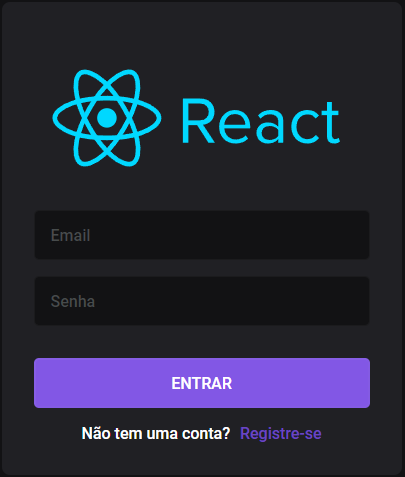
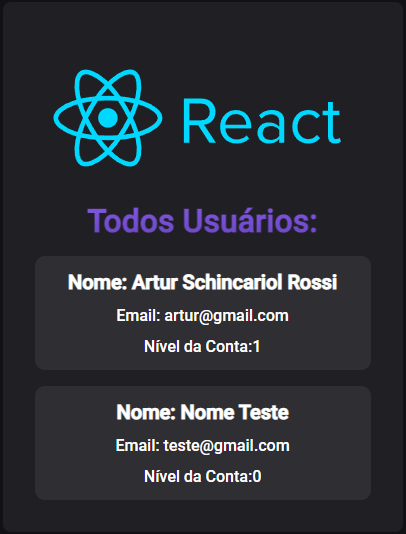

# Auth-Context 🔥

<a href="https://auth-artursrossi.netlify.app/" target="_blank">https://auth-artursrossi.netlify.app/</a>

 
 

  
  
  
  

## 🚀 Pages

| Pages     | Access Type                                                                   |
| --------- | ----------------------------------------------------------------------------- |
| Index     | Public Route                                                                  |
| Register  | Public Route, but when the user is logged in, he is directed to the dashboard |
| Login     | Public Route, but when the user is logged in, he is directed to the dashboard |
| Dashboard | Protected Route, Only logged users can access this route                      |
| Admin     | Protected Route, Only admins can access this route                            |

## 🔖 Admin Account

> To access admin route the user needs to be an admin, because of this, to test the admin route you can use this account:

### Email: artur@gmail.com

### Password: artur123

## 👨🏾‍💻 Security

- JWT Token
- Passwords Hash with Bcrypt (12 Salt Rounds)
- HttpOnly + Secure Cookies
- Protected API Routes
